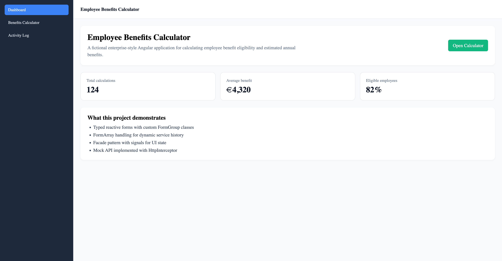
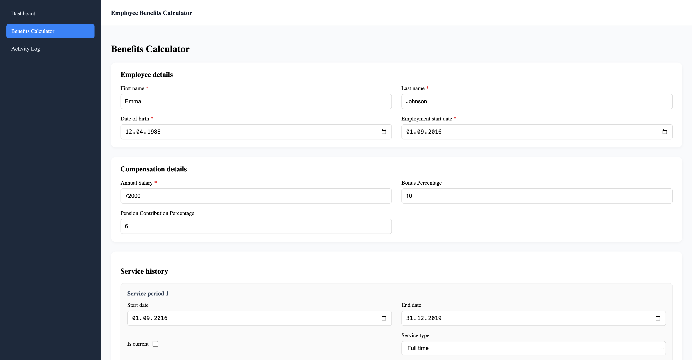
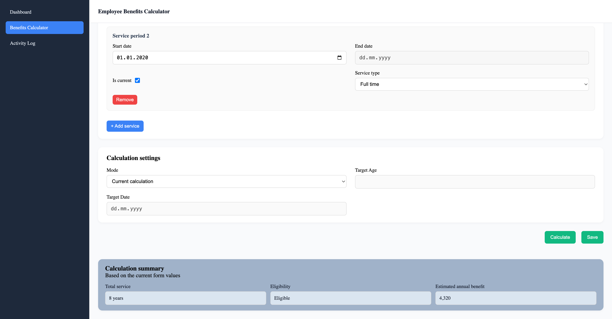
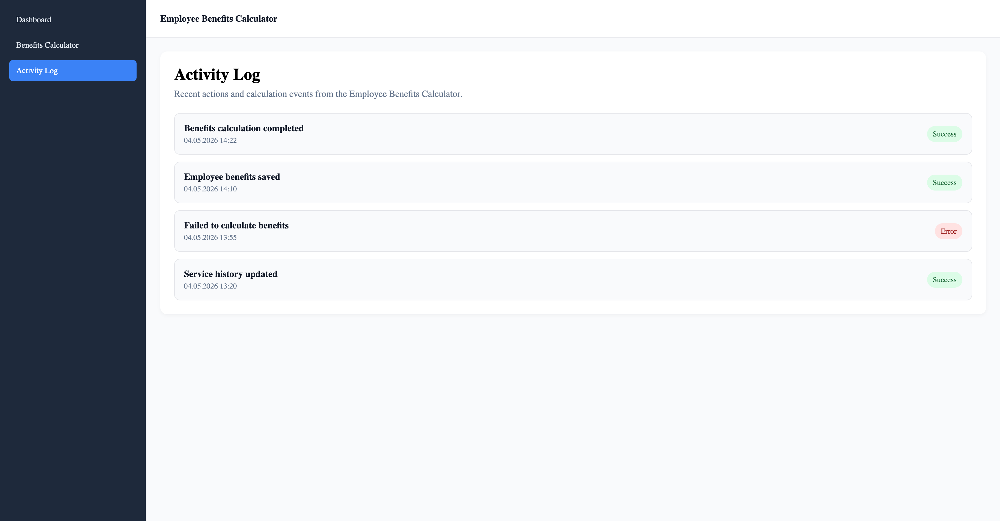

Employee Benefits Calculator

A fictional enterprise-style Angular application for calculating employee benefit eligibility and estimated annual benefits.

This project was built as a portfolio demo to showcase modern Angular development practices, clean feature architecture, typed reactive forms, and separation of concerns.

⸻

Overview

Employee Benefits Calculator allows users to:

* view employee details
* manage compensation data
* edit service history
* calculate benefit eligibility
* estimate annual benefit amount
* save calculation data through a mocked API flow

The business domain is fictional and does not contain any proprietary logic or real client data.

⸻

Why this project

This project was created to demonstrate hands-on Angular skills in a realistic enterprise-style application.
The focus is not on visual complexity, but on clean architecture, maintainable form structure, typed forms, clear data flow, and testable business logic.

⸻

Tech Stack

* Angular 19/20
* Standalone components
* Angular Router
* Typed reactive forms
* Signals
* SCSS
* HttpClient
* HttpInterceptor
* Mock API
* Strict TypeScript

⸻

Architecture

The project follows a feature-based structure:

src/app/
  core/
  shared/
  features/
    benefits-calculator/
      components/
      data-access/
      domain/
      forms/
      pages/

Main architectural layers

Data Access

Responsible for API communication and DTO contracts.

Includes:
* BenefitsApiService
* DTO models
* mock data
* MockApiInterceptor

⸻

Forms

Responsible for form creation, form state, form models, custom FormGroups, validators, and form mapping.

Includes:
* BenefitsCalculatorFormGroup
* EmployeeDetailsFormGroup
* CompensationFormGroup
* CalculationSettingsFormGroup
* ServiceHistoryItemFormGroup
* BenefitsFormService
* validators

⸻

Domain

Responsible for business logic that does not belong to UI, API, or form structure.

Includes:
* BenefitsCalculationService

⸻

Facade

Responsible for orchestration between UI, forms, API, and domain logic.

Includes:
* loading state
* saving state
* calculating state
* error state
* calculation result state

⸻

Form Architecture

The application uses typed reactive forms with custom FormGroup classes.

The form structure is separated from DTO models:
DTO → FormModel → FormGroup
FormGroup → FormModel → DTO

This keeps API contracts independent from UI form state.

Examples of implemented form logic:

* dynamic FormArray for service history
* isCurrent disables and clears endDate
* calculation mode controls required fields dynamically
* cross-field validation for service date ranges
* disabled Save / Calculate buttons when the form is invalid

⸻

Data Flow

User
  ↓
Reactive Form
  ↓
BenefitsFormFacade
  ↓
BenefitsFormService
  ↓
Mapper
  ↓
BenefitsApiService
  ↓
MockApiInterceptor
  ↓
Response
  ↓
Facade state
  ↓
UI

⸻

Features

* Dashboard page
* Benefits Calculator page
* Activity Log page
* AppShell layout with sidebar navigation
* Typed reactive form
* Dynamic service history rows
* Calculation summary
* Mock API through HttpInterceptor
* Loading, saving, success, and error states

⸻

Testing

Testing is planned for the core logic layer.
The intended test scope includes:

* calculation service tests
* validator tests
* mapper tests

The goal is not full test coverage, but meaningful coverage of core business logic.

⸻

How to Run

Install dependencies:
npm install

Start the development server:
npm start

Then open:
http://localhost:4200

⸻

Demo

[Live Demo](https://employee-benefits-calculator.vercel.app/dashboard)

⸻

Screenshots

## Dashboard

## Benefits Calculator

## Activity Log

⸻

Disclaimer

This is a fictional demo project created for portfolio purposes.
It does not contain proprietary code, real business rules, real employee data, or UI copied from any commercial product.